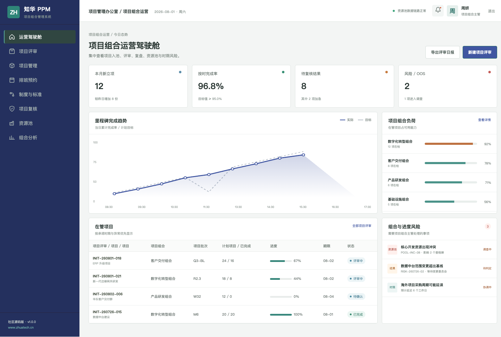
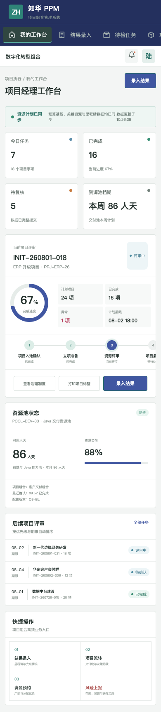

# 知华 PPM：把项目、预算和资源放在同一张图上

[](https://www.zhuatech.cn/) [](backend/) [](frontend/) [](LICENSE)

ZhuaTech PPM 是知华科技（上海如静知华信息科技有限公司）面向企业项目组合治理场景发布的社区源码版。它不只记录任务，而是围绕“该投什么、何时交付、资源是否够、风险是否可控”组织数据。了解产品与定制服务：[知华科技官网](https://www.zhuatech.cn/)。

## 你可以用它管理什么

- 项目组合、项目建议与立项阶段门
- 预算基线、里程碑、交付物和范围变更
- 人员能力池、资源负荷与跨项目冲突
- 组合风险、决策记录和管理层分析
- 项目经理 H5 工作台与管理端驾驶舱

## 运行中的页面

组合管理驾驶舱展示项目健康度、里程碑趋势、资源池负荷和需要管理层处理的风险。



项目经理可在移动端查看优先级、推进里程碑、登记完成情况并上报风险。



## 数据流

```text
项目建议 ──► 立项评审 ──► 组合排期 ──► 资源分配 ──► 阶段门复核 ──► 组合复盘
```

## 工程说明

后端使用 Java 21、Spring Boot、Spring Security、JWT、JPA 与 Flyway，Java 包名为 `cn.zhuatech.ppm`。前端使用 Vue 3、Pinia、Vue Router、Axios 与 Vite；MySQL 8 保存业务数据，H2 执行集成测试；Docker Compose 提供一键部署。

```bash
# 轻量演示
cd frontend && npm install && npm run dev:demo

# 完整环境
cp .env.example .env
docker compose up --build
```

访问 `http://localhost:5173`。组合管理端账号 `planner / Demo@2026`，项目经理端账号 `operator / Demo@2026`。仓库中的项目、人员、预算与指标均为虚构演示数据。

## 许可不是可选项

本工程仅可用于个人学习、研究和非商业技术交流，**不得商用**。企业内部使用、生产部署、商业交付、SaaS、收费培训、咨询实施、二次销售和去除品牌等行为，必须取得上海如静知华信息科技有限公司书面授权，详见 [LICENSE](LICENSE)。

需要 PPM 深度定制、系统集成或私有化部署，可访问[知华科技官网](https://www.zhuatech.cn/)或扫码联系：

| 商务与技术咨询 | 项目实施咨询 |
| --- | --- |
|  |  |

搜索词：PPM 源码、项目组合管理系统、项目资源管理、Java PPM、Vue 项目管理、知华科技。
